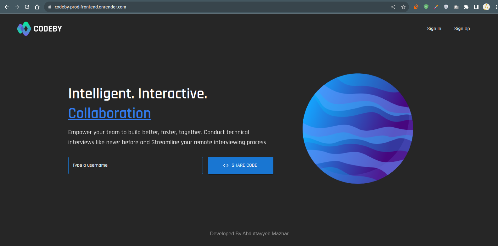

# Realtime CodeEditor Server

Welcome to the server component for the CodeBy Realtime CodeEditor project. This server provides essential backend support for creating and managing code editing rooms with real-time collaboration features.

## Deployed Version
[](https://codeby-prod-frontend.onrender.com/)

You can access a deployed version of the CodeBy Realtime CodeEditor on Render.

LIVE - [https://codeby-prod-frontend.onrender.com](https://codeby-prod-frontend.onrender.com/).

This version is hosted online and ready for you to use and collaborate with others in real-time. Enjoy coding together!


## Running the App with Docker

To get the CodeBy Realtime CodeEditor server up and running locally using Docker, follow these steps:

1. **Clone the Repository**: First, clone the repository containing the server code.

2. **Docker Compose File**:
    - Ensure you have Docker and Docker Compose installed on your system.
    - I have a `docker-compose.yml` file which defines the Redis server and the Node application, and gets them up and running on the same network without much of a hassle.

3. **Dockerfile**:
    - Make sure you have a `Dockerfile` which sets up the Node.js environment for your application.

4. **Build and Run**:
    - Open a terminal and navigate to your project directory.
    - Build the Docker image by running the following command:

    ```sh
    docker compose up --build
    ```

    This will start the Redis server and your CodeBy Realtime CodeEditor server.

5. **Access the Server**:
    - By default, the server will be accessible at `http://localhost:5000`.


## Contact
- Portfolio: [Abduttayyeb's Portfolio](https://abduttayyeb.github.io)
- LinkedIn: [Abduttayyeb on LinkedIn](https://linkedin.com/in/abduttayyeb)

Feel free to connect with Abduttayyeb on LinkedIn and explore their portfolio for more information and to stay updated with their projects and professional activities.